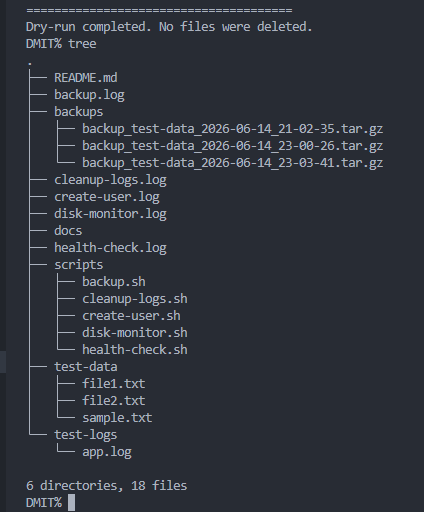
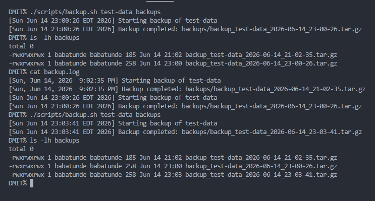
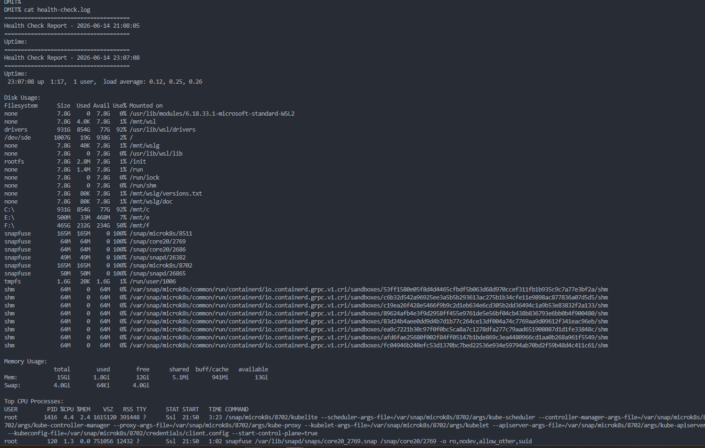
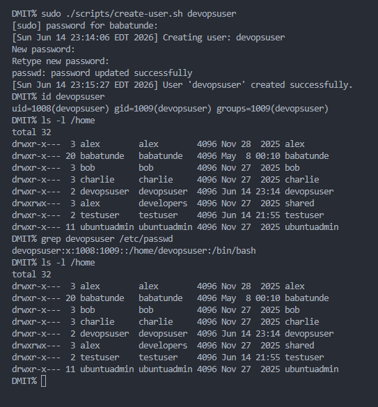
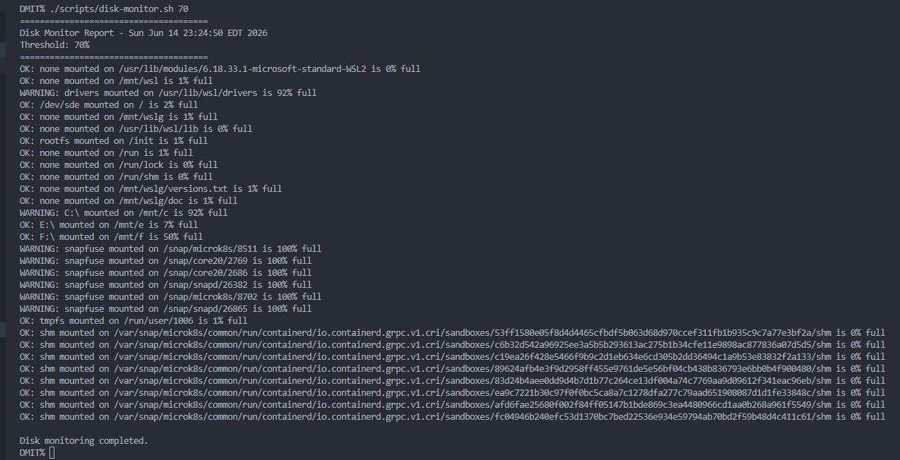
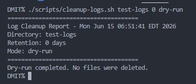
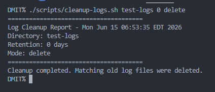
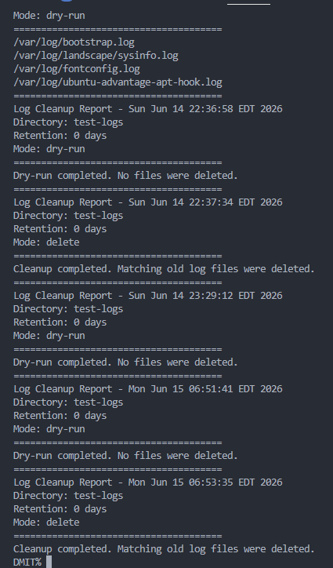
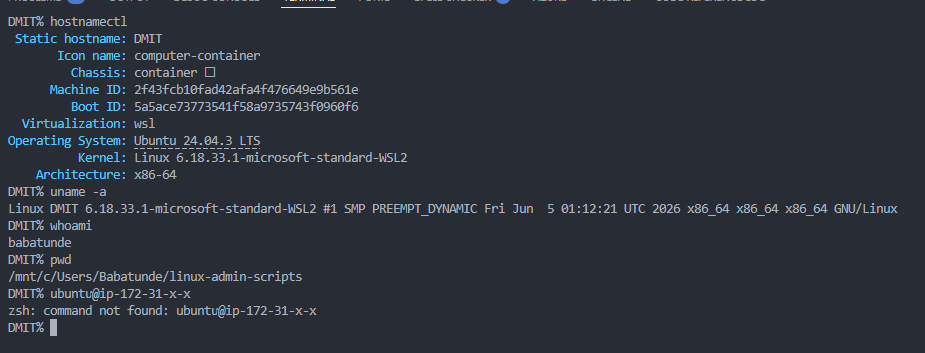

# Linux Admin Scripts

Production-ready Bash scripts for Linux system administration and DevOps automation.


---

## Overview

This repository contains a collection of Linux administration scripts designed to automate common operational tasks. The project demonstrates practical DevOps skills including automation, monitoring, backup management, user administration, logging, and system maintenance.

The scripts follow production-oriented Bash scripting practices such as:

* Input validation
* Error handling
* Logging
* Safe execution
* Reusable automation
* Linux administration best practices

---

## Features

* Automated backups with timestamps
* System health monitoring
* Linux user provisioning
* Disk usage monitoring
* Automated log cleanup
* Logging and reporting
* Production-style Bash scripting

---

## Project Structure

```text
linux-admin-scripts/
├── scripts/
│   ├── backup.sh
│   ├── health-check.sh
│   ├── create-user.sh
│   ├── disk-monitor.sh
│   └── cleanup-logs.sh
│
├── docs/
│
├── screenshots/
│
└── README.md
```

---

## Scripts

### backup.sh

Creates compressed backups with timestamps.

#### Features

* Creates `.tar.gz` archives
* Timestamped backup names
* Logging support
* Source directory validation

#### Example

```bash
./scripts/backup.sh /home/ubuntu/data backups
```

---

### health-check.sh

Generates a server health report.

#### Checks

* System uptime
* Disk usage
* Memory usage
* CPU utilization
* Top resource-consuming processes

#### Example

```bash
./scripts/health-check.sh
```

---

### create-user.sh

Creates Linux users with validation and logging.

#### Features

* Username validation
* Home directory creation
* Password setup
* Logging

#### Example

```bash
sudo ./scripts/create-user.sh devopsuser
```

---

### disk-monitor.sh

Monitors disk usage and generates warnings when usage exceeds a specified threshold.

#### Features

* Configurable threshold
* Warning alerts
* Logging

#### Example

```bash
./scripts/disk-monitor.sh 80
```

---

### cleanup-logs.sh

Safely removes old log files.

#### Features

* Dry-run mode
* Configurable retention period
* Safe deletion
* Reporting

#### Example

Dry Run:

```bash
./scripts/cleanup-logs.sh /var/log 7 dry-run
```

Delete Mode:

```bash
sudo ./scripts/cleanup-logs.sh /var/log 7 delete
```

---

## Example Output

### Disk Monitor

```text
WARNING: /dev/xvda1 mounted on / is 87% full
```

### Backup Script

```text
[2026-06-14] Starting backup...
[2026-06-14] Backup completed successfully.
```

---

## Screenshots

### Backup Script


### Health Check


### Disk Monitor


---

## Technologies Used

* Linux
* Bash
* Git
* GitHub
* AWS EC2
* Ubuntu Server

---

## Skills Demonstrated

### Linux Administration

* User management
* Disk management
* Log management
* Process monitoring

### Automation

* Backup automation
* Cleanup automation
* Monitoring automation

### DevOps Practices

* Infrastructure scripting
* Logging
* Error handling
* System monitoring
* Operational automation

---

## Future Enhancements

* Email notifications
* Slack integration
* Cron scheduling examples
* Log rotation support
* Prometheus integration
* Grafana dashboards

---

## Installation

Clone the repository:

```bash
git clone https://github.com/yourusername/linux-admin-scripts.git
```

Navigate to the project:

```bash
cd linux-admin-scripts
```

Make scripts executable:

```bash
chmod +x scripts/*.sh
```
## Screenshots

### Project Structure



---

### Backup Script Execution


### Backup Log



---

### Health Check Report


### Health Check Log



---

### User Creation



### User Verification


---

### Disk Monitoring


### Disk Monitor Log



---

### Log Cleanup (Dry Run)



### Log Cleanup (Delete Mode)



### Cleanup Log



---

---

### AWS EC2 Testing Environment



---

### Repository Homepage


---

## Author

**Babatunde**

DevOps & Cloud Engineer

* GitHub: https://github.com/digimind34
* LinkedIn: https://linkedin.com/in/babatunde-ayo-devops

---

## License

This project is licensed under the MIT License.
